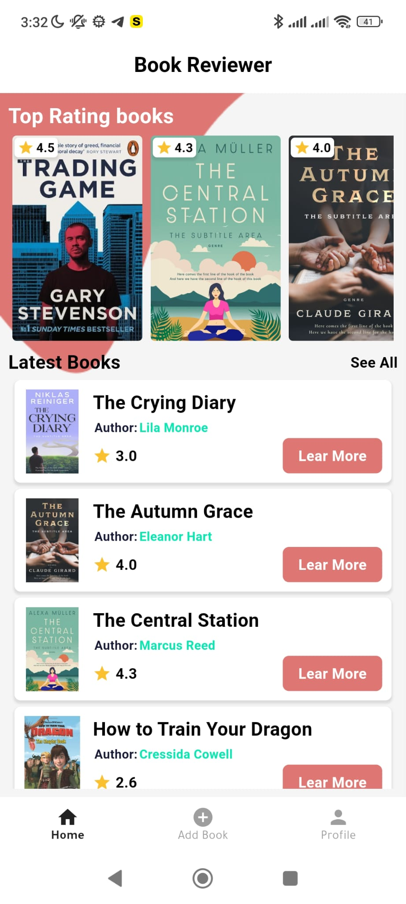
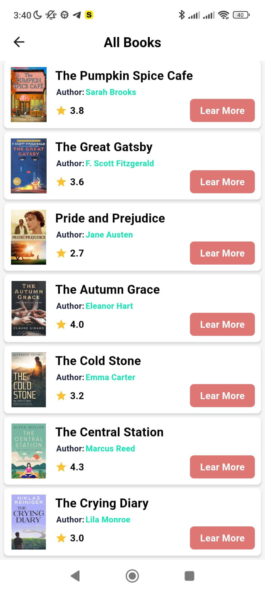
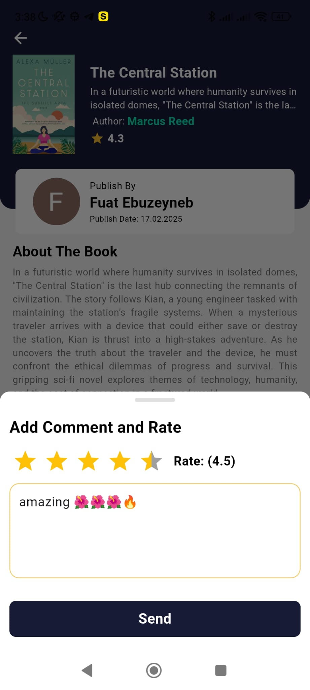
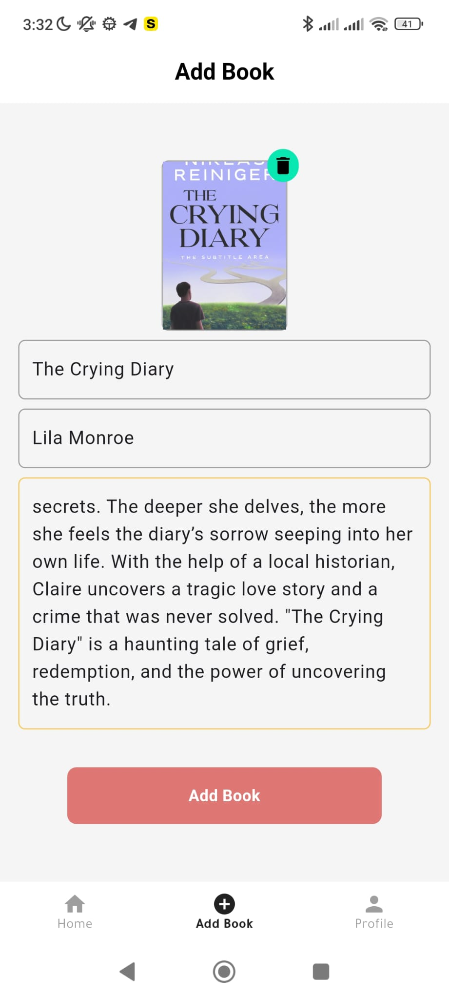

# Book Review Application

## Overview
This is a **Book Review Application** built with **Flutter** and **Firebase**. The app allows users to sign up, log in, publish books, and leave reviews/comments on books published by other users.

## Screenshots & Demo
Here are some screenshots of the app:

<p align="center">
  
  
  
  
  
  
  
  
</p>

## Features
- **User Authentication & Authorization**
  - Firebase Authentication for sign-up/login
  - Firebase Firestore for storing user data
  - Secure session management

- **Book Management**
  - Publish books with details (title, author, description, cover image)
  - List all published books
  - View book details
  - Update & delete books (only by the owner)

- **Review & Comment System**
  - Users can review/comment on others' books
  - View all reviews for a book
  - Edit or delete own reviews/comments

- **Additional Functionalities**
  - Firebase security rules for permissions
  - Error handling for unauthorized actions
  - Pagination for books

## Tech Stack
- **Frontend:** Flutter with GetX for state management
- **Backend:** Firebase Authentication, Firestore, Firebase Storage
- **State Management:** GetX
- **Storage:** Firestore (for data), Firebase Storage (for images)
- **Authentication:** Firebase Auth (email/password & Google)

## Project Structure
```
lib/
├── controllers/  # GetX controllers
├── models/       # Data models (Books, Users, Reviews)
├── views/        # UI components
├── services/     # Firebase interactions (Auth, Firestore, Storage)
├── routes/       # Navigation handling (GetX routes)
```

## Installation
1. Clone the repository:
   ```bash
   git clone <repository-url>
   ```
2. Navigate to the project directory:
   ```bash
   cd book_review_app
   ```
3. Install dependencies:
   ```bash
   flutter pub get
   ```
4. Set up Firebase:
   - Create a Firebase project
   - Enable Firestore, Authentication, and Storage
   - Download `google-services.json` (Android) and `GoogleService-Info.plist` (iOS)
   - Place them in the respective directories

5. Run the app:
   ```bash
   flutter run
   ```

## Packages Used
- **get:** For state management
- **firebase_auth:** Firebase Authentication
- **cloud_firestore:** Firestore database
- **firebase_storage:** Storing book cover images
- **fluttertoast:** Toast messages
- **image_picker:** Selecting images for book covers
- **google_sign_in:** Google authentication for user login/sign-up
- **uuid:** Generating unique IDs for books, users, and reviews
- **flutter_rating_bar:** Displaying interactive star ratings for book reviews


## Contact
- Email: fuatebuzeyneb@gmail.com
- **LinkedIn:** [Fuat Ebuzeyneb LinkedIn](https://www.linkedin.com/in/fuat-ebuzeyneb-b7b29b282/) 


